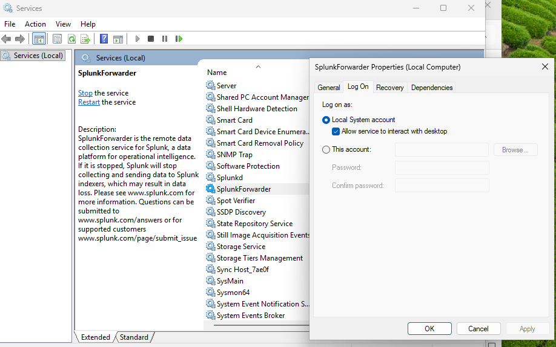

# Sysmon Log Ingestion

## Objective
The goal of this step was to get the Sysmon logs into Splunk so I could search, filter, and investigate them from one place instead of using Event Viewer.

## Background
Sysmon records Windows activity and writes those events to the `Microsoft-Windows-Sysmon/Operational` event log.

Splunk Enterprise acts as the SIEM by storing and indexing those events so they can be searched later. To actually get the logs into Splunk, I configured the Splunk Universal Forwarder to monitor the Sysmon event log and send the data to Splunk Enterprise.

## Implementation
- Installed Splunk Enterprise
- Enabled receiving on TCP port 9997
- Installed the Splunk Universal Forwarder
- Configured the forwarder to monitor the Sysmon Operational log
- Configured the forwarder to send events to Splunk Enterprise
- Verified the configuration was being loaded
- Verified the forwarder was connected to Splunk

## Verification
- Sysmon events were still being generated in Event Viewer
- Splunk Enterprise was listening on port 9997
- The Universal Forwarder showed an active connection
- Sysmon events appeared in Splunk using: index=main
- Verified the configuration was loaded

## Troubleshooting

The forwarder connected to Splunk right away, but I wasn't seeing any Sysmon events.

I first verified that the Universal Forwarder was connected and that the inputs configuration had loaded correctly. Since everything appeared to be configured properly, I checked Splunk's internal logs and found an "Access Denied" error when the forwarder attempted to read the Sysmon Operational event log.

The issue ended up being the account the SplunkForwarder service was running under. After changing the service to run as Local System and restarting the service, Sysmon events immediately began appearing in Splunk.

### SplunkForwarder Service Configuration

After identifying the permission issue, I determined that the SplunkForwarder service account did not have permission to read the Sysmon Operational event log. Changing the service to run as the **Local System** account resolved the issue and allowed Sysmon events to be forwarded to Splunk.

## What I Learned
- A successful forwarder connection does not necessarily mean data is being ingested.
- Windows service permissions can prevent event log collection even when Splunk appears healthy.
- Troubleshooting should begin by verifying each stage of the telemetry pipeline instead of assuming the configuration is wrong.
- Separating the responsibilities of Sysmon, Windows Event Log, Universal Forwarder, and Splunk Enterprise made it much easier to isolate problems.

